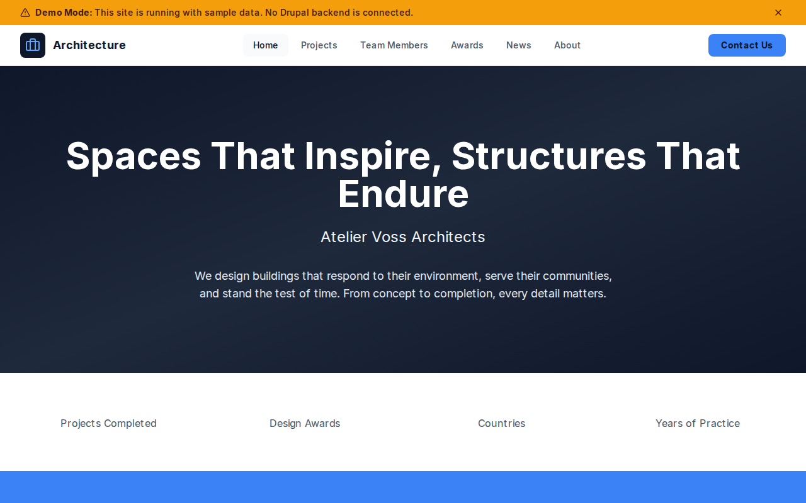

# Decoupled Architecture

An architecture firm website starter template for Decoupled Drupal + Next.js. Built for architecture practices, design studios, and building design firms looking to showcase their portfolio and team.



## Features

- **Projects** - Display completed architecture works with project type, location, year, square footage, and featured imagery
- **Team Members** - Present architects and design professionals with positions, bios, and contact information
- **Awards** - Highlight industry awards and recognitions with awarding bodies, associated projects, and year received
- **News** - Publish firm news, competition wins, press coverage, and sustainability announcements
- **Modern Design** - Clean, accessible UI optimized for architecture portfolio content

## Quick Start

### 1. Clone the template

```bash
npx degit nextagencyio/decoupled-architecture my-architecture-firm
cd my-architecture-firm
npm install
```

### 2. Run interactive setup

```bash
npm run setup
```

This interactive script will:
- Authenticate with Decoupled.io (opens browser)
- Create a new Drupal space
- Wait for provisioning (~90 seconds)
- Configure your `.env.local` file
- Import sample content

### 3. Start development

```bash
npm run dev
```

Visit [http://localhost:3000](http://localhost:3000)

---

## Manual Setup

If you prefer to run each step manually:

<details>
<summary>Click to expand manual setup steps</summary>

### Authenticate with Decoupled.io

```bash
npx decoupled-cli@latest auth login
```

### Create a Drupal space

```bash
npx decoupled-cli@latest spaces create "My Architecture Firm"
```

Note the space ID returned (e.g., `Space ID: 1234`). Wait ~90 seconds for provisioning.

### Configure environment

```bash
npx decoupled-cli@latest spaces env 1234 --write .env.local
```

### Import content

```bash
npm run setup-content
```

This imports:
- Homepage with hero section, firm statistics, and project consultation CTAs
- 3 Projects (Riverside Civic Center, Meridian Tower, Contemporary Arts Museum)
- 3 Team Members (Founding Principal, Partner - Sustainability, Partner - Urban Design)
- 3 Awards (AIA National Honor Award, RIBA International Prize Shortlist, Green Building Council Excellence)
- 3 News Articles (London Office Opening, Oslo Opera Competition Win, Carbon-Neutral Commitment)
- About page and Contact page

</details>

## Content Types

### Project
- **Project Type** - Category of architecture work (e.g., Civic & Cultural, Commercial & Residential)
- **Location** - Project city and state/country
- **Year Completed** - Completion year
- **Square Footage** - Total area of the project
- **Featured Image** - Main project photograph

### Team Member
- **Position** - Job title or role at the firm
- **Email** - Professional email address
- **Photo** - Professional headshot

### Award
- **Awarding Body** - Organization granting the award (e.g., AIA, RIBA)
- **Award Year** - Year the award was received
- **Project Name** - Associated project name
- **Featured Image** - Award or project photograph

### News
- **News Category** - Article category (Firm News, Competition, Sustainability)
- **Featured Image** - Main image for the news item

## Customization

### Colors & Branding
Edit `tailwind.config.js` to customize colors, fonts, and spacing.

### Content Structure
Modify `data/architecture-content.json` to add or change content types and sample content.

### Components
React components are in `app/components/`. Update them to match your design needs.

## Demo Mode

Demo mode allows you to showcase the application without connecting to a Drupal backend.

### Enable Demo Mode

Set the environment variable:

```bash
NEXT_PUBLIC_DEMO_MODE=true
```

### Removing Demo Mode

To convert to a production app with real data:

1. Delete `lib/demo-mode.ts`
2. Delete `data/mock/` directory
3. Delete `app/components/DemoModeBanner.tsx`
4. Remove `DemoModeBanner` from `app/layout.tsx`
5. Remove demo mode checks from `app/api/graphql/route.ts`

## Deployment

### Vercel (Recommended)
[](https://vercel.com/new/clone?repository-url=https://github.com/nextagencyio/decoupled-architecture)

Set `NEXT_PUBLIC_DEMO_MODE=true` in Vercel environment variables for a demo deployment.

### Other Platforms
Works with any Node.js hosting platform that supports Next.js.

## Documentation

- [Decoupled.io Docs](https://www.decoupled.io/docs)
- [Next.js Documentation](https://nextjs.org/docs)
- [Drupal GraphQL](https://www.decoupled.io/docs/graphql)

## License

MIT
